# PROYECTO 2 LENGUAJE DE MARCAS

## Tienda Online de compra/venta de Vinilos: RETROVINYL

Introducción

Este proyecto es una página web para RetroVinyl, una tienda online de discos de vinilo. Inspirada en 'Discogs'. El objetivo de la página es ofrecer una experiencia atractiva para los amantes del vinilo, destacando los productos y servicios, como un catálogo de vinilos, de reproductores de estos, un carrito de compras, y formas de contacto. También se trató de crear una web clara y fácil de usar, sin liarla demasiado, con un diseño adaptable para que se vea bien tanto en ordenadores como en móviles.

La web está compuesta por varias páginas, cada una con un propósito diferente: la página principal donde se muestra un resumen de lo que hacemos, una sección con el catálogo de vinilos, una página de contacto con un formulario para que los usuarios nos escriban, y una página “Sobre Nosotros” donde explicamos la historia de RetroVinyl y el equipo que está detrás.

Además, todo está hecho siguiendo buenas prácticas en HTML5 y CSS3, con un diseño responsive para que funcione bien en diferentes dispositivos. Y, por supuesto, hemos procurado que todo sea accesible para que cualquier persona pueda navegar sin problemas.


>_Logo de la página_

## Características del Proyecto

La web está estructurada en cuatro páginas principales que son completamente accesibles y adaptables a diferentes dispositivos. Estas páginas son:

- **Página Principal**: Incluye una introducción con un resumen del sitio.
- **Carrito**: Simula un carrito de compra visto en otras páginas.
- **Página de Contacto**: Formulario para que los usuarios puedan ponerse en contacto.
- **Sobre Nosotros**: Información sobre la historia de la tienda y su equipo.

Cada página utiliza etiquetas semánticas de HTML5 y está diseñada con la metodología BEM para los estilos CSS.

### Descripción de etiquetas usadas

- **`<header>`**: Define la cabecera del sitio, incluyendo el logo y la navegación.
- **`<nav>`**: Contiene los enlaces de navegación.
- **`<main>`**: Contiene el contenido principal de la página.
- **`<section>`**: Agrupa partes relacionadas del contenido.
- **`<footer>`**: Proporciona información adicional al final de la página.
- **`<form>`**: Define un formulario para la entrada de datos (atributos `action`, `method`).
- **`<input>`, `<select>`, `<textarea>`**: Elementos de formulario para obtener información del usuario.
- **``**: Muestra una imagen (atributos `src` y `alt`).
- **`<a>`**: Crea enlaces (atributos `href` y `target`).
- **`<article>`**: Define contenido independiente o relacionado.

```html
   <!-- Contenido Principal -->
    <main class="main">
        <section class="main__section">
            <h2 class="main__title">Top Ventas</h2>
            <ul class="main__list">
                <li class="main__item">
                    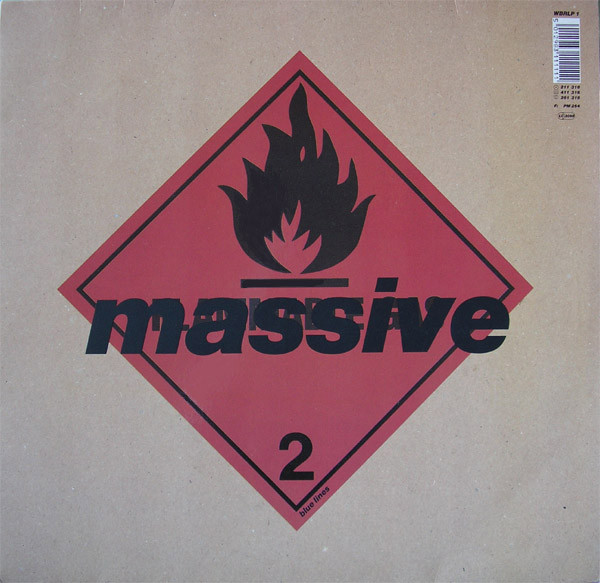
                    <p class="main__item-title">Blue Lines - Massive Attack</p>
                </li>
                <li class="main__item">
                    
                    <p class="main__item-title">Richard D James - Aphex Twin</p>
                </li>
                <li class="main__item">
                    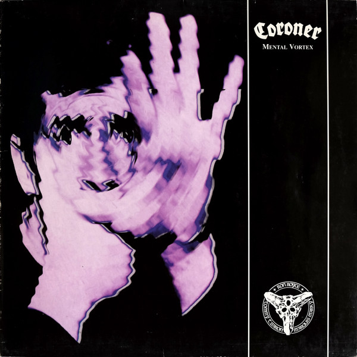
                    <p class="main__item-title">Mental Vortex - Coroner</p>
                </li>
                <li class="main__item">
                    
                    <p class="main__item-title">A Great Chaos - Ken Carson</p>
                </li>
                <li class="main__item">
                    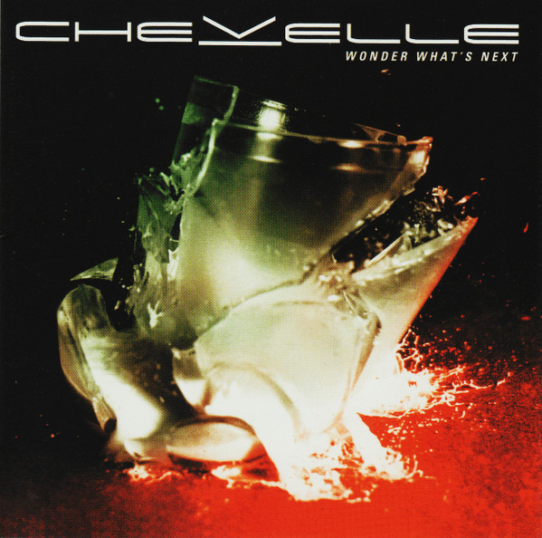
                    <p class="main__item-title">Wonder What's Next - Chevelle</p>
                </li>
            </ul>
        </section>

 <!-- Footer -->
    <footer class="footer">
        <section class="footer__info">
            <h2>Información</h2>
            <p>&copy; 2025 RetroVinyl - Todos los derechos reservados.</p>
        </section>
        <section class="footer__links">
            <h2>Enlaces</h2>
            <ul class="footer__list">
                <li class="footer__item"><a href="privacidad.html" class="footer__link">Política de Privacidad</a></li>
                <li class="footer__item"><a href="terminos.html" class="footer__link">Términos y Condiciones</a></li>
                <li class="footer__item"><a href="cookies.html" class="footer__link">Política de Cookies</a></li>
            </ul>
        </section>
        <section class="footer__social">
            <h2>Síguenos en:</h2>
            <ul class="footer__social-list">
                <li class="footer__social-item"><a href="#" class="footer__social-link">Facebook</a></li>
                <li class="footer__social-item"><a href="#" class="footer__social-link">Instagram</a></li>
                <li class="footer__social-item"><a href="#" class="footer__social-link">Twitter</a></li>
            </ul>
        </section>
    </footer>
```

_Ejemplo de código mostrando el uso de las etiquetas_

### Validación de los archivos HTML

Se usó el lugar web 'https://validator.w3.org/' para comprobar que los archivos HTML estaban perfectamente validados. Solo obtuve "warnings" y a mi sorpresa ningún error grave. El warning consistía en emplear un mejor uso de los h2-h6..

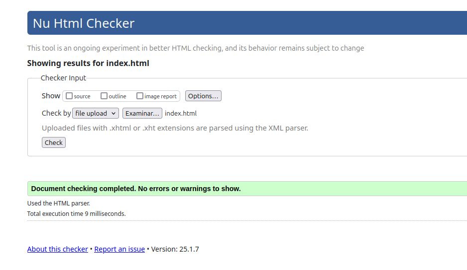
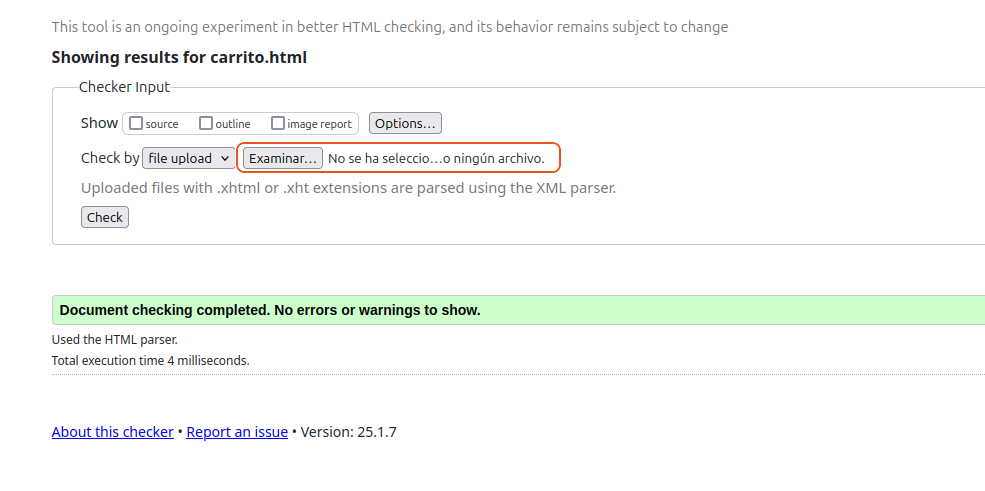
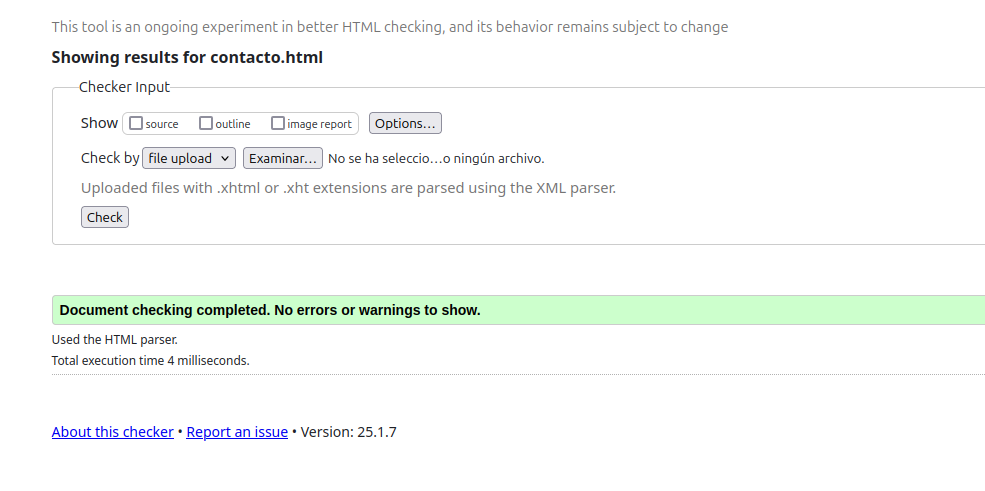
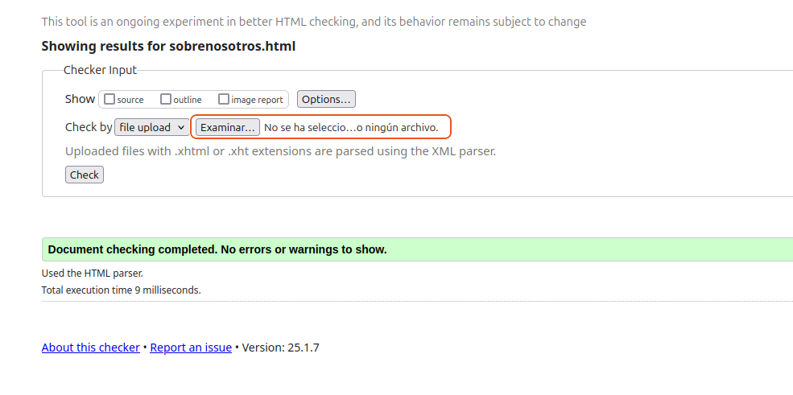

### Herramientas utilizadas

Todo este proyecto se llevo acabo en el editor _Visual Studio Code_ utilizando las ultimás versiones de HTML y CSS.

Como extensiones, se usarón _Prettier_ para una mejor legibilidad y persistencia del código. Y el tema de _Monokai_ meramente por gustos estéticos.

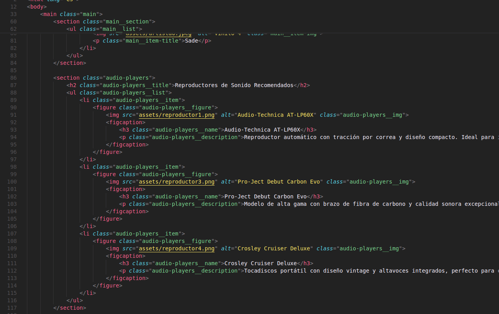

También para el redactado en markdown de este readme, se uso la extension _Markdownlint_ que te permite una mejor estructura del markdown y corregir errores con un atajo de teclado (Ctrl + O en mi caso)

En cuanto al control de versiones, se empleo el confiable Git y todo ello localizado en un repositorio Github. Desde el propio IDE permite una comodidad absoluta para hacer _commit_ y _push_

### Estructura de Carpetas 

Se usó la siguiente estructura a la hora de estructurar el proyecto. Tal cual indicaba las pautas a seguir, archivos html en el directorio principal, acompañado un archivo markdown Readme y de carpetas como **css** y **assets** para el código CSS y depositar las imagenes, respectivamente.

### Hojas de Estilo

#### Validaciones

Se usó un solo archivo CSS siguiendo la metodología BEM (Bloque Elemento Modificador) para una estructura clara y concisa del CSS y que sea más liviano a la hora de aplicar cambios a este.

Para este caso, se volvió a emplear la validación del archivo CSS mediante el sitio web 'https://jigsaw.w3.org/css-validator/'

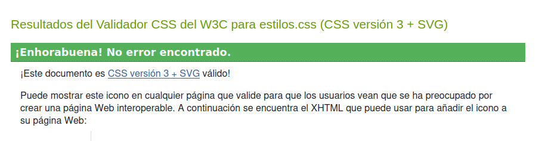

#### Variables

```css
:root {
    --color-background: #F9F9F9;
    --color-text: #222222;
    --color-highlight: #FFC700;
    --color-secondary: #E0E0E0;
}
```

_Ejemplo de las hojas de estilo que aplica los colores principales de la página_

```css
.main__item {
    flex: 0 0 auto;
    width: 12rem;
    text-align: center;
    background-color: var(--color-secondary);
    border: 0.06rem solid var(--color-highlight);
    border-radius: 0.5rem;
    padding: 0.5rem;
    transition: transform 0.3s;
}
```

_Otro ejemplo mostrando un bloque_

#### Animaciones y transiciones

Mediante keyframes, se implementaron distintas animaciones y transiciones a los objetos de la página.

```css
.main__item:hover {
    transform: scale(1.05);
    animation: shake 0.5s ease-out;
}

@keyframes shake {
    0% {transform: rotate(0);}
    25% {transform: rotate(10deg);}
    50% {transform: rotate(-10deg);}
    75% {transform: rotate(5deg);}
    100% {transform: rotate(0);}
}
```

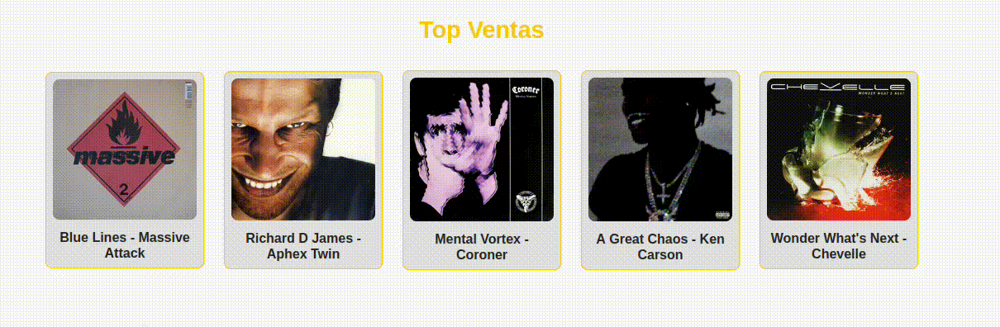

#### Responsividad

Uso de los _media query_ para darle responsividad a la página y que pueda visualizarse en distintos dispositivos con sus respectivos tamaños de pantalla.

```css
@media (max-width: 480px) {
    .header__logo {
        font-size: 1.5rem;
    }

    .cart__item {
        grid-template-columns: 1fr;
        text-align: center;
    }

    .cart__item-img {
        margin: 0 auto;
    }

    .cart__item-title,
    .cart__item-price {
        font-size: 1.2rem;
    }

    .cart__checkout-btn,
    .cart__item-remove {
        font-size: 1rem;
        padding: 0.8rem;
    }

    .cart__coupons-form {
        display: flex;
        flex-direction: column;
    }

    .cart__coupons-input {
        width: 100%;
        margin-bottom: 1rem;
    }
}
```


#### Modo Oscuro

Aunque no funcional, el modo oscuro está correctamente implementado usando una variable que cambia los colores de la página principal para mejor comodidad visual.

```css
/* Tema Oscuro (No funcional aún) */
:root.dark-mode {
    --color-background: #222222;
    --color-text: #F9F9F9;
    --color-highlight: #FFD700; 
    --color-secondary: #333333;
}

.theme-toggle {
    background: var(--color-highlight);
    border: none;
    border-radius: 50%;
    width: 2.5rem;
    height: 2.5rem;
    cursor: not-allowed; /* Indica que no es funcional por ahora */
    display: flex;
    align-items: center;
    justify-content: center;
    box-shadow: 0 0.2rem 0.5rem rgba(0, 0, 0, 0.3);
    transition: background 0.3s ease;
    transition: background-color 0.3s ease, transform 0.3s ease;
}
```

Aquí puede verse como quedaría implementado:

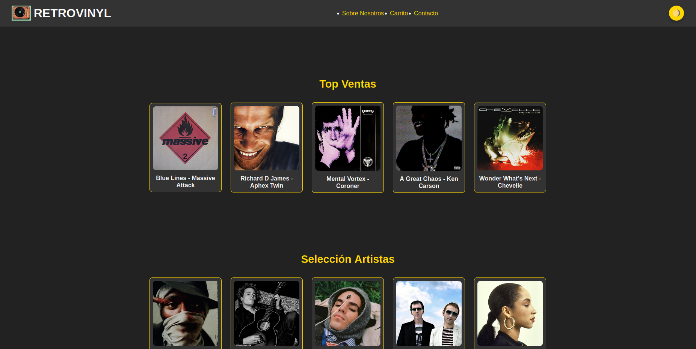


#### Conclusiones

Hasta aquí la documentación de mi Proyecto Web para Lenguaje de Marcas. Ha estado entretenido y tedioso por partes iguales y ha llegado a cuestionarme mi cordura por momentos, pero a lo que le he pillado el truco, resultó ser satisfactorio. Siento curiosidad por terminar de darle forma una vez veamos Javascript. 

Gracias por tu tiempo! :D

